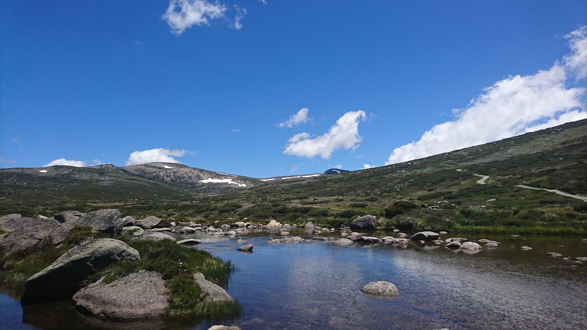

# About

Hi, I'm J.

In 2018 I started working full time as a software developer. This gave me some time to think about how I might try to give back to the software development community.

I'm hoping to write about my experiences in the software industry, problems I've faced with tools and solutions/hacks that I've discovered (or been gifted) along the way as well as a few interesting algorithms that I've learnt a bit about.

I have a particular interest in 'safe' languages, machine learning, and logic engines. Specifically I'm a big fan of Haskell and [Rust](./?search=Rust), but have more experience in C++ and Python.

I live in Sydney with my lovely wife and Peanut, our Japanese Spitz. They mean everything to me.

---

Kosciuszko National Park

---
