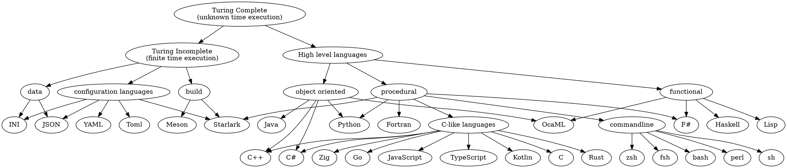
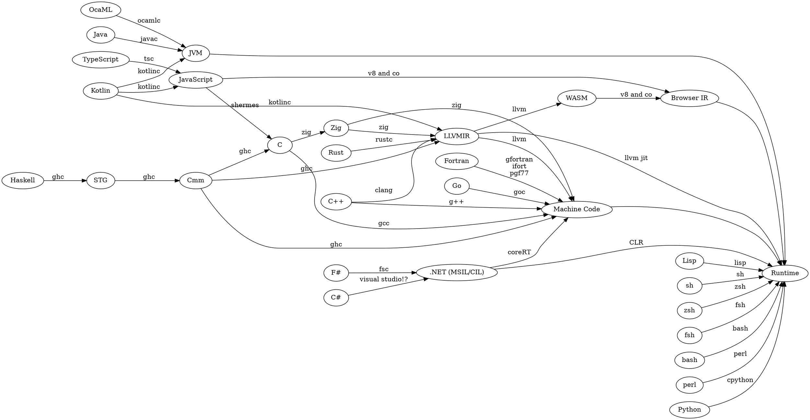

<!--
published: false
title: Lambda Calculus: Building little languages
category: [Programming, Languages, Lambda Calculus, IR]
excerpt: |
feature_text: |
  **I believe in the separation of Church and State **
feature_image: "/assets/imgs/koz3.JPG"
image: "/assets/imgs/koz3.JPG"
-->

# WIP - Work in progress

The following post is a work in progress, but I thought I'd keep uploading it as a way to push myself to finish it sooner rather than later.

# Lambda Calculus: Building little languages

In my work I have had several opportunities to build tooling for other developers.
Specifically these have been tools for assembling apps, programs and infrastructure using a high level language.

These have mostly been experimental, either exploring the benefits of different compiler architectures, approaches to optimisation or programming paradigms.

So, I've been stuck with a question:

> How do we build a programming language from the smallest number of the simplest parts possible?

Many approaches have been taken to building programming languages and compilers, and there are almost as many approaches to doing so.

## A small family tree of programming language models

<div class="center">





</div>


## My favourite approach: Lambda Calculus

My favourite class of approaches is to build a small core language and build everything on top of that. This has a few benefits that I hope to detail here.

## TODO: Finish

```rust,no_run
{{#rustdoc_include lambda-calc/p1.rs:definition}}
```

```rust,no_run
{{#rustdoc_include lambda-calc/p1.rs:helpers}}
```

```rust
{{#rustdoc_include lambda-calc/p1.rs:demo1}}
```


Here's the full code for you to experiment with:

```rust,editable
{{#rustdoc_include lambda-calc/p1.rs:all}}
```
