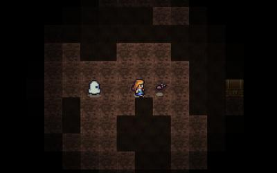

<!--
published: false
title: Lost - 13kb of js
category: [Javascript, Minifying, Games]
excerpt: |
    TODO:Excerpt here!
feature_text: |
    **We got to the moon with 4kb**
feature_image: "/assets/imgs/koz1.JPG"
image: "/assets/imgs/koz1.JPG"
-->

Computers have gotten *smarter* over time, a lot smarter. You've probably heard of [Moore's law](https://en.wikipedia.org/wiki/Moore%27s_law). It's hard to appreciate the vast amount of RAM our modern laptops and phones have in comparison to earlier computer.

The original [Apollo guidance computer](https://en.wikipedia.org/wiki/Apollo_Guidance_Computer) had `2048 words` of RAM. Each word is `16 bits`, bringing the total RAM to `4kb`.

It was used in the Apollo program to plan the route of the Command & Service module and Lunar Module ([citation](https://ntrs.nasa.gov/archive/nasa/casi.ntrs.nasa.gov/20090016290.pdf)) and was an amazing piece of kit at the time (1966 - 1975).

These days, few popular web pages can fit in `4kb`. I don't think that's a bad thing, though it gives us some room for improvement. It's just a part of the cost of all the improvements that we have made.

It turns out that there's still a lot that can be done in just a few kilobytes and there are a bunch of competitions that are centered around this. The most famous of which (that I know of) being the [**js1k**](https://js1k.com/) competition.

The aim is simple:
> Make a game in JavaScript that fits in 1 kilobyte!

You can [minify](https://en.wikipedia.org/wiki/Minification_(programming)), compress, use terse style, anything, as long as it fits in `1kilobyte`.

The [**js1k**](https://js1k.com/) competitors are pretty amazing, I recommend playing a few of their games (they download really quickly too).

`1kb` is pretty restrictive, and I was (and am) pretty new to [code golfing](https://www.reddit.com/r/codegolf/), so I have yet to try the `1kb` variety. However, a friend of mine is a pretty awesome web developer and invited me to compete with him in the [**js13k**](https://js13kgames.com/) competition. It's basically the same as the [**js1k**](https://js1k.com) games... but as you can probably guess, you get `13kb`.

So, with `13kb` to play with we could implement almost anything we liked, and definitely more things that we had time for writing from scratch.

[Try it out here](https://cypher1.github.io/13k_lost/public/)

Here's our entry on [js13kgames.com](https://js13kgames.com/entries/lost-caves)

And here's [Sam's site](https://wemyss.github.io/).

----
